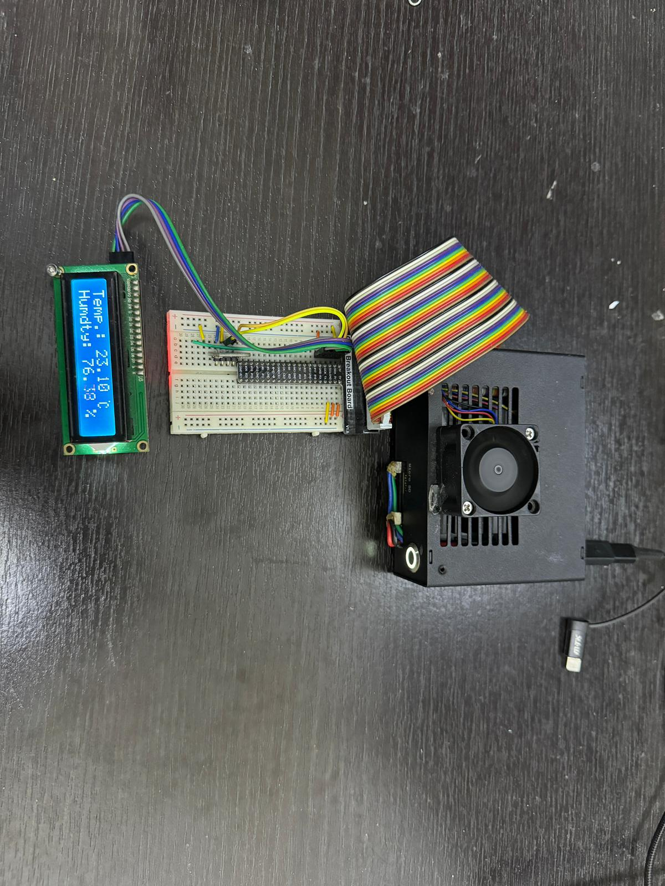
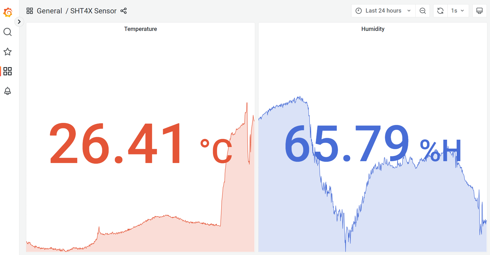
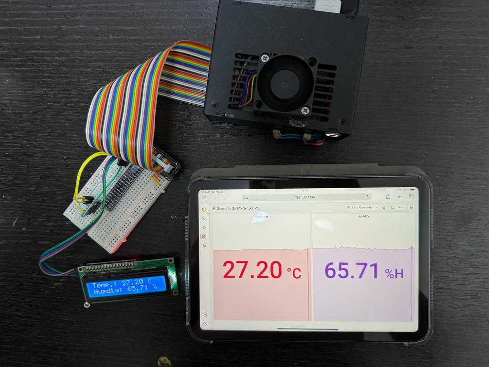

# sht4x_docker
#sht4x sensor #Docker #Prometheus #Grafana

This project contains a Python script for reading data from the SHT4X sensor.

# Description
The SHT4X series humidity and temperature sensors, renowned for their high accuracy and versatility. These sensors, including models like SHT40, SHT41, and SHT45, offer superior precision and are optimized for low power consumption, making them ideal for diverse applications.
<br>
<br>

# Part 1 : Getting Started

### Connecting the Sensor

Your sensor has the four different connectors: VCC, GND, SDA, SCL. Use
the following pins to connect your SHT4x:

 *SHT4x*  |    *Raspberry Pi*
 :------: | :------------------:
   VCC    |        Pin 1 (3.3V)
   GND    |        Pin 6
   SDA    |        Pin 3
   SCL    |        Pin 5

## Wiring example
   

### Installing on Jetson Nano or Raspberry Pi
 - Clone the repository to your local machine.
 - Ensure that Python 3 is installed.
 - Navigate to the driver directory. For example:
    ```bash
    cd ~/sht4x_docker/example_sht4x_pybind11/
    ```
 - Generate the sht4x.cpython-36m-aarch64-linux-gnu.so file. This is a library that is imported in py_sht4x_read.py. Instructions on how to generate this file should be provided here.

    1. Open a terminal
    2. Navigate to the driver directory. E.g. `cd ~/sht4x_docker/example_sht4x_pybind11/`
    3. Run the `setup_pybind11.sh` command to generate the library. 
    
    You may need to change the permissions by running the command:
    ```bash
    chmod +x ./setup_pybind11.sh
    ```
    This shell script will help to run the script below:
    ```bash
    git clone https://github.com/pybind/pybind11.git
    mkdir build

    chmod +x cmake.sh
    ./cmake.sh
    ```

    Once the setup scripts are executed, the generated library file `sht4x.cpython-36m-aarch64-linux-gnu.so` will be located in `sht4x_docker/example_sht4x_pybind11/build/`.
<br>
<br>
<br>
# Part 2 : Running in Docker

### 2.1 Setup Prometheus and Grafana
   ```bash
   cd _install_db
   ```

Then follow the shell scripts in folder `_install_db` to install Prometheus and Grafana.

### 2.2 Build and Run the Docker Container
   ```bash
   cd ..
   ./build_and_run.sh
   ```
### 2.3 Setup Grafana Dashboard
1. **Access Grafana Interface**: Typically at `http://localhost:3000`. Default login is usually `admin`/`admin`.

2. **Add Data Source**: Go to Configuration > Data Sources > Add data source. Choose and configure your data source like Prometheus.

3. **Create Dashboards**: Click "+" > Dashboard. Add and configure panels to visualize data.

4. **Customize Panels**: Query your data source and choose from various visualization options (graphs, tables, etc.).

5. **Explore and Share**: Interact with real-time data, adjust settings, and share dashboards as needed.

<br>
<br>

# Part 3 : Results


  

  

## Acknowledgments

- This project uses libraries from [pybind11](https://github.com/pybind/pybind11) and [Sensirion Raspberry Pi I2C SHT4x](https://github.com/Sensirion/raspberry-pi-i2c-sht4x).
- Special thanks to all contributors who have helped with the development and testing of this project.

## References

### Pybind11 Integration for SHT4X Sensor Control
This project uses Pybind11 to create Python bindings for C++ code, enabling efficient interaction with SHT4X sensors. It compiles C++ functions into a Python module, allowing Python scripts to directly control the sensor hardware with the performance benefits of C++ and the ease of Python.

### Docker
This project utilizes Docker to ensure a consistent environment for running the Python script. The Dockerfile sets up a lightweight Python environment, installs necessary dependencies, and prepares the script and libraries for execution. The containerized setup simplifies deployment and ensures consistent performance across platforms.

### Prometheus
The script integrates with Prometheus to facilitate the monitoring of sensor data. It exposes temperature and humidity metrics that Prometheus can scrape. This integration allows for effective data visualization and monitoring, leveraging Prometheus's powerful data processing and alerting capabilities.

### Grafana Overview
Grafana is a powerful open-source analytics and monitoring solution. It allows users to create, explore, and share dashboards that display real-time data from various sources, such as Prometheus, in visually compelling and interactive formats. It's widely used for time-series data visualization in diverse environments.

### Explain build_and_run.sh Script
   ```docker
   docker build . -t sht4x_docker
   docker run                 \
   --name=sht4x_docker        \
   --group-add=dialout      \
   --privileged=true        \
   --restart=unless-stopped \
   -it -d                   \
   -p=30001:9090            \
   sht4x_docker
   ```
- Builds the Docker image with: `docker build . -t sht4x_docker`.
- Runs the container using `docker run` with several options:
  - `--name=sht4x_docker`: Sets the container's name.
  - `--group-add=dialout` and `--privileged=true`: Grants necessary permissions for hardware interaction.
  - `--restart=unless-stopped`: Ensures automatic restart unless explicitly stopped.
  - `-it -d`: Runs the container in detached, interactive mode.
  - `-p=30001:9090`: Maps port 9090 inside the container to port 30001 on the host for Prometheus metrics.


### Explain metrics.py

`metrics.py` contains the `Metrics` class, which uses `prometheus_client` to define and update Prometheus metrics for temperature and humidity. It initializes two `Gauge` metrics and starts an HTTP server on port 9090 for Prometheus scraping. The `update_temperature` and `update_humidity` methods set the values for these metrics.


## License

This project is licensed under the Apache License 2.0. See the [LICENSE](LICENSE) file for the full license text. The Apache License 2.0 is a permissive open-source license that allows you to freely use, modify, distribute, and sell your software, provided that you include the required notices and do not use the trademarked names in the names of derived products without permission.